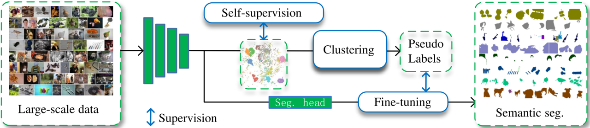
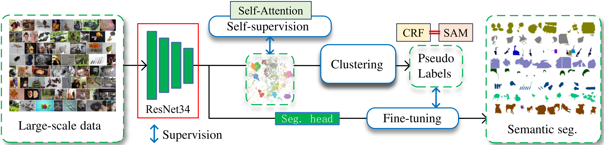

# Jittor 大规模无监督语义分割赛题

## 简介
大规模无监督语义分割是计算机视觉领域的一个活跃研究领域，在自动驾驶、遥感、医学成像和视频监控等领域有许多潜在的应用，其涉及不使用有标签训练数据的情况下自动将图像内的相似区域或对象分组在一起。该任务的目标是生成一个语义分割图，将图像中的每个像素分配给特定的语义类别，例如“车辆”、“建筑”或“天空”等。

南开大学在TPAMI2022上提出了ImageNet-S数据集(Large-scale unsupervised semantic segmentation)，该数据集基于ImageNet，具有120万张训练图像和50K个高质量语义分割标签。其中分为50/300/full三个子数据集，本赛题选用50类的子数据集，其中训练集/验证集/测试集的图片数分别为64431/752/1682。

## 方案总体
本次比赛我们采用的方案遵循baseline模型（PASS），针对PASS算法中几个重要模块，我们进行了改进和优化：

>
>PASS的框架图

* Self-supervision （我们针对原PASS算法中的Pixel Attention进行改进）
* Clustering （针对生成的伪标签，我们采用流行的CRF和最新的SAM进行优化）
* Fine-tuning （我们将语义分割头替换成[EANet](https://github.com/MenghaoGuo/EANet)）

## 方案设计
我们所提出的方案核心包括两个方面：
* 采用双模型进行USS训练及推理
* 利用SAM模型对生成的Pseudo Labels进行优化

下面针对所提方案进行详细介绍：

### 模型训练
我们采用了双模型策略，如下图所示：
>
模型1（**R18**）：采用PASS框架，使用ResNet18作为backbone，同时使用CRF和SAM优化后的伪标签训练模型。

>
模型2（**R34**）：采用具有Self-Attention的PASS框架，使用ResNet34作为backbone，同时使用CRF和SAM优化后的伪标签训练模型。

## 模型推理
在推理阶段，我们采用上述训练好的两个模型R18和R34，然后对测试集进行推理，流程如下图所示：
>
测试方案：使用R18和R34分别推理得到初始预测Masks，然后将结果进行集成，随后经过CRF和SAM优化得到的Masks，最后通过PerSAM算法对结果进行再次优化，最终得到预测结果。

## 安装 

#### 运行环境
- ubuntu 18.04 LTS
- python 3.7
- jittor == 1.3.7.16

#### 安装依赖
无特定依赖项

#### 预训练模型
预训练模型模型包含R18和r34两个模型，分别放置在特定目录``./weithg/pass50_r18_bz128_ep400/pixel_finetuning_ep40_lr0.6_sz256/checkpoint.pth.tar``和``./weithg/pass50_r34_bz128_ep400/pixel_finetuning_ep40_lr0.6_sz384/checkpoint.pth.tar``。

## 训练
* 训练时，将数据放在``./data/train``下(50个子目录)
* 然后直接运行测试脚本，``sh train.sh``
* 模型保存在相应位置

## 推理
* 测试时，将数据放在``./data/test``下(50个子目录)
* 然后直接运行测试脚本，``python test.py``
* 结果保存在``./result``

## 参考算法库
* PASS框架：https://github.com/LUSSeg/PASS/tree/jittor

* CRF：https://github.com/lucasb-eyer/pydensecrf

* SAM：https://github.com/facebookresearch/segment-anything and https://github.com/cskyl/SAM_WSSS

* PerSAM：https://github.com/ZrrSkywalker/Personalize-SAM
